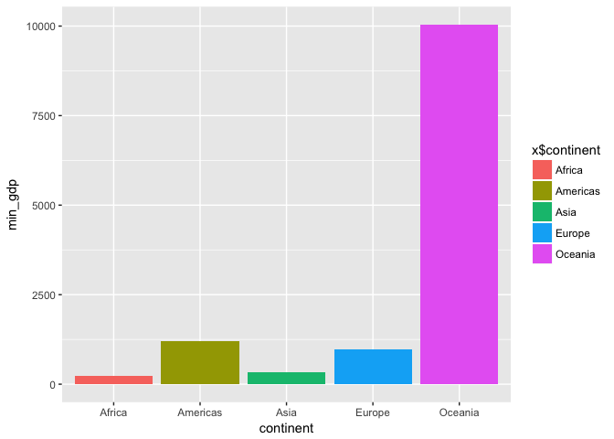
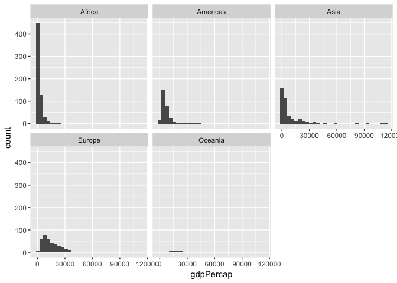
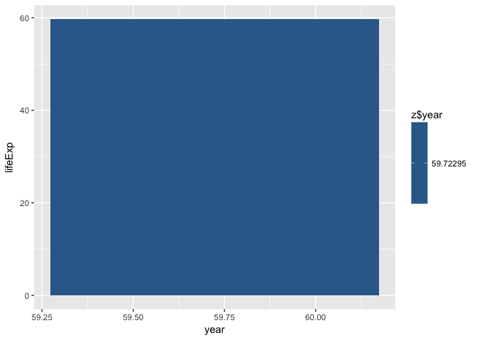

Untitled
================

Homework 03: Use dplyr and ggplot2 to manipulate and explore data
-----------------------------------------------------------------

In this homework, we will be further develope the functions of dplyr and ggplot2 on the Gapminder data set. Specific questions will be used as examples to demonstrate how we can use dplyr and ggplot2.

First of all, we have to load our data set and necessary packages

``` r
install.packages("gapminder",repos = "http://cran.us.r-project.org")
```

    ## 
    ## The downloaded binary packages are in
    ##  /var/folders/49/8x4vsmg52bg_f8qccj5r6pw00000gn/T//Rtmp6G0yhZ/downloaded_packages

``` r
install.packages("tidyverse",repos = "http://cran.us.r-project.org")
```

    ## 
    ## The downloaded binary packages are in
    ##  /var/folders/49/8x4vsmg52bg_f8qccj5r6pw00000gn/T//Rtmp6G0yhZ/downloaded_packages

``` r
install.packages("knitr",repos = "http://cran.us.r-project.org")
```

    ## 
    ## The downloaded binary packages are in
    ##  /var/folders/49/8x4vsmg52bg_f8qccj5r6pw00000gn/T//Rtmp6G0yhZ/downloaded_packages

``` r
library(gapminder)
library(tidyverse)
```

    ## Loading tidyverse: ggplot2
    ## Loading tidyverse: tibble
    ## Loading tidyverse: tidyr
    ## Loading tidyverse: readr
    ## Loading tidyverse: purrr
    ## Loading tidyverse: dplyr

    ## Warning: package 'tibble' was built under R version 3.4.1

    ## Warning: package 'tidyr' was built under R version 3.4.1

    ## Warning: package 'purrr' was built under R version 3.4.1

    ## Warning: package 'dplyr' was built under R version 3.4.1

    ## Conflicts with tidy packages ----------------------------------------------

    ## filter(): dplyr, stats
    ## lag():    dplyr, stats

``` r
library(knitr)
```

    ## Warning: package 'knitr' was built under R version 3.4.1

``` r
library(ggplot2)
```

Task 1: The maximum and minimum of GDP per capita for all continents
--------------------------------------------------------------------

To solve this question, we first want to pull out the information about the maxium and minium GDP per capita of each continent. A table would be help for showing this information.

``` r
x <- gapminder %>%
  group_by(continent) %>%
  summarize(max_gdp = max(gdpPercap),min_gdp = min(gdpPercap))
x
```

    ## # A tibble: 5 x 3
    ##   continent   max_gdp    min_gdp
    ##      <fctr>     <dbl>      <dbl>
    ## 1    Africa  21951.21   241.1659
    ## 2  Americas  42951.65  1201.6372
    ## 3      Asia 113523.13   331.0000
    ## 4    Europe  49357.19   973.5332
    ## 5   Oceania  34435.37 10039.5956

Here we get the max and min gdp per capital of each continent. However, if we want the table to be neat or want to publish it we can use the knitr:kable function

``` r
knitr::kable(x)
```

| continent    |      max\_gdp|                                min\_gdp|
|:-------------|-------------:|---------------------------------------:|
| Africa       |      21951.21|                                241.1659|
| Americas     |      42951.65|                               1201.6372|
| Asia         |     113523.13|                                331.0000|
| Europe       |      49357.19|                                973.5332|
| Oceania      |      34435.37|                              10039.5956|
| Now, we woul |  d like to de|  pict the data in graph by using ggplot|

First, we will show the maxium gdp per capita in histogram

``` r
ggplot(x,aes(x=continent,y=max_gdp)) + geom_bar(stat="identity")
```

 We can see that Asia has the maxium gdp per capital. We will then show the minium gpd per capital but with color.

``` r
ggplot(x,aes(x=continent,y=min_gdp, fill=x$continent)) + geom_bar(stat="identity")
```



From this graph, we see that Africa and Asia has low gdp per capita. Combine both of the plots, we can see that Asia has a diverse gdp per capita range.

Task 2: Look at the spread of GDP per capita within the continents
------------------------------------------------------------------

Sometimes table could be too lengthy and massy for summarize big data results. For exapmle, in this Task, it would be difficult to look at the spread of GDP per capita in the table form. It would be much better to pick the graphical option.

We would do this by each continent

``` r
y <- gapminder%>%
  group_by(continent)
ggplot(y,aes(x=gdpPercap))+facet_wrap(~ continent)+geom_histogram() 
```

    ## `stat_bin()` using `bins = 30`. Pick better value with `binwidth`.

 We see that in Asia and Africa, most contries have low gdp per capita where as in America, Europe and Oceania, the distrubution mostly in the middle.

Task 3: Compute a trimmed mean of life expectancy for different years
---------------------------------------------------------------------

In this task, we want to do a trimmed mean.The trimmed mean removes skewed points to make the mean more accurate.Let's set the data to 5% trimmed mean.

``` r
z <- gapminder%>%
  select(year,lifeExp)%>%
  summarise_each(funs(mean(lifeExp, trim=0.05)))
```

    ## `summarise_each()` is deprecated.
    ## Use `summarise_all()`, `summarise_at()` or `summarise_if()` instead.
    ## To map `funs` over all variables, use `summarise_all()`

``` r
z
```

    ## # A tibble: 1 x 2
    ##       year  lifeExp
    ##      <dbl>    <dbl>
    ## 1 59.72295 59.72295

``` r
ggplot(z, aes(x=year, y = lifeExp,fill=z$year)) + geom_bar(stat="identity")
```



The life expectancy has increase almost 20 years in 50 years.
