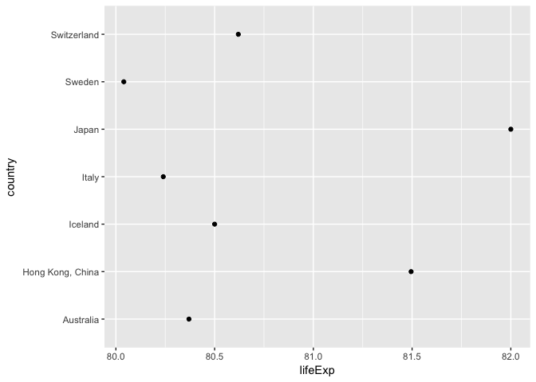
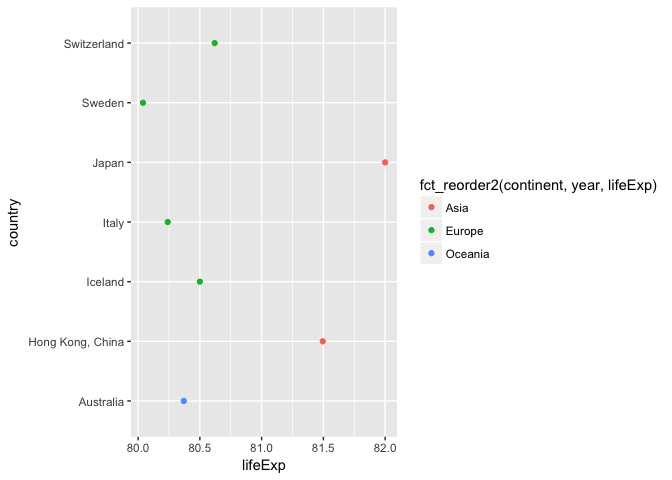
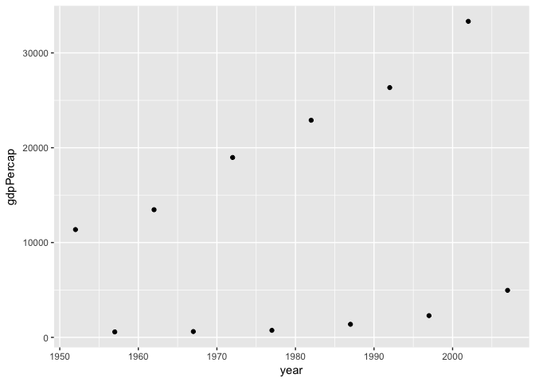
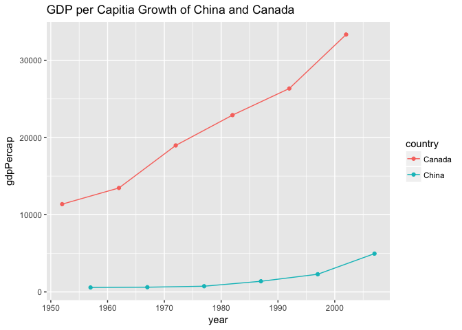

Hw05
================

Homework 05
-----------

In this homework, the goal is to learn how to manage factors, how to import and export file as well as plots, and how to improve the quality of plots.

Factor management
-----------------

In R, the categorical variable is stored as factors. For example, in the gapminder data, contienet has 5 categorical variables: "Asia""America""Europe""Africa"and"Oceania". However, they are actually stored as factors like 1, 2, 3..

``` r
library(gapminder)
library(tidyverse)
```

    ## Loading tidyverse: ggplot2
    ## Loading tidyverse: tibble
    ## Loading tidyverse: tidyr
    ## Loading tidyverse: readr
    ## Loading tidyverse: purrr
    ## Loading tidyverse: dplyr

    ## Warning: package 'tibble' was built under R version 3.4.1

    ## Warning: package 'tidyr' was built under R version 3.4.1

    ## Warning: package 'purrr' was built under R version 3.4.1

    ## Warning: package 'dplyr' was built under R version 3.4.1

    ## Conflicts with tidy packages ----------------------------------------------

    ## filter(): dplyr, stats
    ## lag():    dplyr, stats

``` r
library(forcats)
```

``` r
str(gapminder)
```

    ## Classes 'tbl_df', 'tbl' and 'data.frame':    1704 obs. of  6 variables:
    ##  $ country  : Factor w/ 142 levels "Afghanistan",..: 1 1 1 1 1 1 1 1 1 1 ...
    ##  $ continent: Factor w/ 5 levels "Africa","Americas",..: 3 3 3 3 3 3 3 3 3 3 ...
    ##  $ year     : int  1952 1957 1962 1967 1972 1977 1982 1987 1992 1997 ...
    ##  $ lifeExp  : num  28.8 30.3 32 34 36.1 ...
    ##  $ pop      : int  8425333 9240934 10267083 11537966 13079460 14880372 12881816 13867957 16317921 22227415 ...
    ##  $ gdpPercap: num  779 821 853 836 740 ...

From here, we see that characters are converted to integers to represent the catorgrical variables.

Drop Oceania
------------

In this section, the section of data associates with continent "Oceania" will be dropped and also the factor level because the factor level could still appear in the legend without removing it. We would verify the rows as well as the factor level after the removal of Oceania.

``` r
gap_nooceania <- filter(gapminder,!continent %in% "Oceania")
summary(gap_nooceania)
```

    ##         country        continent        year         lifeExp     
    ##  Afghanistan:  12   Africa  :624   Min.   :1952   Min.   :23.60  
    ##  Albania    :  12   Americas:300   1st Qu.:1966   1st Qu.:48.08  
    ##  Algeria    :  12   Asia    :396   Median :1980   Median :60.34  
    ##  Angola     :  12   Europe  :360   Mean   :1980   Mean   :59.26  
    ##  Argentina  :  12   Oceania :  0   3rd Qu.:1993   3rd Qu.:70.75  
    ##  Austria    :  12                  Max.   :2007   Max.   :82.60  
    ##  (Other)    :1608                                                
    ##       pop              gdpPercap       
    ##  Min.   :6.001e+04   Min.   :   241.2  
    ##  1st Qu.:2.780e+06   1st Qu.:  1189.1  
    ##  Median :7.024e+06   Median :  3449.5  
    ##  Mean   :2.990e+07   Mean   :  7052.4  
    ##  3rd Qu.:1.987e+07   3rd Qu.:  8943.2  
    ##  Max.   :1.319e+09   Max.   :113523.1  
    ## 

``` r
gap_nooceania_drop <- gap_nooceania %>%
  droplevels()
summary(gap_nooceania_drop)
```

    ##         country        continent        year         lifeExp     
    ##  Afghanistan:  12   Africa  :624   Min.   :1952   Min.   :23.60  
    ##  Albania    :  12   Americas:300   1st Qu.:1966   1st Qu.:48.08  
    ##  Algeria    :  12   Asia    :396   Median :1980   Median :60.34  
    ##  Angola     :  12   Europe  :360   Mean   :1980   Mean   :59.26  
    ##  Argentina  :  12                  3rd Qu.:1993   3rd Qu.:70.75  
    ##  Austria    :  12                  Max.   :2007   Max.   :82.60  
    ##  (Other)    :1608                                                
    ##       pop              gdpPercap       
    ##  Min.   :6.001e+04   Min.   :   241.2  
    ##  1st Qu.:2.780e+06   1st Qu.:  1189.1  
    ##  Median :7.024e+06   Median :  3449.5  
    ##  Mean   :2.990e+07   Mean   :  7052.4  
    ##  3rd Qu.:1.987e+07   3rd Qu.:  8943.2  
    ##  Max.   :1.319e+09   Max.   :113523.1  
    ## 

``` r
levels(gap_nooceania$continent)
```

    ## [1] "Africa"   "Americas" "Asia"     "Europe"   "Oceania"

``` r
levels(gap_nooceania_drop$continent)
```

    ## [1] "Africa"   "Americas" "Asia"     "Europe"

``` r
nlevels(gap_nooceania$continent)
```

    ## [1] 5

``` r
nlevels(gap_nooceania_drop$continent)
```

    ## [1] 4

``` r
nrow(gapminder)
```

    ## [1] 1704

``` r
nrow(gap_nooceania_drop)
```

    ## [1] 1680

We have seen that 24 rows were removed as well as one factor level.

Reorder the level of continent
------------------------------

In the above section, the factor level is ordered by alphabetical order, from Africa to Oceania. However, sometimes we want to have them ordered differently. For example, we want to have the continent with the most countries to be the first because they would weighted more. We can do this by first point out the critiria for ordering and then the sequence of the list, either forward or reverse.

``` r
## First, we check the default order. 

gapminder$continent %>% 
  levels()
```

    ## [1] "Africa"   "Americas" "Asia"     "Europe"   "Oceania"

``` r
## The order is arranged alphabetically. Let's try if we want to order the continent from the most countries to the leaset. (Frenquency)

gapminder$continent %>%
  fct_infreq() %>%
  levels() 
```

    ## [1] "Africa"   "Asia"     "Europe"   "Americas" "Oceania"

``` r
## ALso, we can arrange them in reverse from least to most countries

gapminder$continent %>%
  fct_infreq() %>%
  fct_rev() %>%
  levels() 
```

    ## [1] "Oceania"  "Americas" "Europe"   "Asia"     "Africa"

``` r
## We can use fct_order function to reorder our data by median, mean, max or mini, whichever suits our need.

fct_reorder(gapminder$continent,gapminder$gdpPercap) %>%
  levels() 
```

    ## [1] "Africa"   "Asia"     "Americas" "Europe"   "Oceania"

``` r
## The default setting is ordered from low to high. In this case Africa has the lowest gdp per capitia. The order can be reversed 

fct_reorder(gapminder$continent,gapminder$gdpPercap) %>%
  fct_rev() %>%
  levels() 
```

    ## [1] "Oceania"  "Europe"   "Americas" "Asia"     "Africa"

``` r
## The order is flipped. We can also try arrange by maxium life expectancy

fct_reorder(gapminder$country, gapminder$lifeExp, max) %>%
  levels() %>% head()
```

    ## [1] "Sierra Leone" "Angola"       "Afghanistan"  "Liberia"     
    ## [5] "Rwanda"       "Mozambique"

``` r
## Sierra Leone has the lowest life expectancy and we can also reverse the order by using fct_reorder to see the country with highest life expectancy.


fct_reorder(gapminder$country, gapminder$lifeExp, max, .desc = TRUE) %>% levels() %>% head()
```

    ## [1] "Japan"            "Hong Kong, China" "Iceland"         
    ## [4] "Switzerland"      "Australia"        "Spain"

``` r
## In this case, we can see that Japan has the highest life expectancy. 
```

Arrange vs reoder effect on plots
---------------------------------

In this section, we will demonstrate how the function "arrange" differs from "reorder" on a graph.

We will use the plot that shows countries that have life expectancy above 80 in the year 2002 as the exmaple

``` r
gap_arrange <- gapminder %>%
  filter(lifeExp >80, year == 2002) %>%
   arrange(continent) 

ggplot(gap_arrange, aes(x=lifeExp, y=country))+geom_point()
```



``` r
gap_reorder <-  gapminder %>%
  filter(lifeExp >80, year == 2002)

ggplot(gap_reorder, aes(x = lifeExp, y = country,color = fct_reorder2(continent, year, lifeExp))) + geom_point()
```



Ok. To be honest, I did not really get this part and I found them to be same. I think reorder probably have more degree of freedom to change the arragment of data was the concept.

File I/O
--------

After all, we need to save and export our work into portable format. For example, let's try export the gap\_reorder data.

``` r
write.csv(gap_reorder, "gap_reorder.csv")
```

The file is successfully created. Now, let's try import data into R. We can either import by click on R studio's import function or type in the code.

``` r
read_csv("gap_reorder.csv")
```

    ## Warning: Missing column names filled in: 'X1' [1]

    ## Parsed with column specification:
    ## cols(
    ##   X1 = col_integer(),
    ##   country = col_character(),
    ##   continent = col_character(),
    ##   year = col_integer(),
    ##   lifeExp = col_double(),
    ##   pop = col_integer(),
    ##   gdpPercap = col_double()
    ## )

    ## # A tibble: 7 x 7
    ##      X1          country continent  year lifeExp       pop gdpPercap
    ##   <int>            <chr>     <chr> <int>   <dbl>     <int>     <dbl>
    ## 1     1        Australia   Oceania  2002  80.370  19546792  30687.75
    ## 2     2 Hong Kong, China      Asia  2002  81.495   6762476  30209.02
    ## 3     3          Iceland    Europe  2002  80.500    288030  31163.20
    ## 4     4            Italy    Europe  2002  80.240  57926999  27968.10
    ## 5     5            Japan      Asia  2002  82.000 127065841  28604.59
    ## 6     6           Sweden    Europe  2002  80.040   8954175  29341.63
    ## 7     7      Switzerland    Europe  2002  80.620   7361757  34480.96

The folder that the file being export to and import from is the default folder of R.

Visulization design
-------------------

Now, let's try make our plot prettier. There are many things we can do to improve our plot and easier for reader to understand it. We can use colors, make indications of points, label axis porperly and etc

Let's use Canada and China's gdp per capita trend as the example

``` r
Canada_China_gdp1 <- gapminder %>%
  filter(country == c("Canada","China"))
ggplot(Canada_China_gdp1, aes(x= year, y= gdpPercap)) + geom_point()
```



This is the most simplistic plot to show the information. Now, let's make some improvements.

``` r
ggplot(Canada_China_gdp1, aes(x= year, y= gdpPercap, fill=country, color = country)) + geom_point() + ggtitle("GDP per Capitia Growth of China and Canada") + geom_line()
```



Ok. Now we have a much nicer plot with color, legend and title.

We will save it in png and jpeg format.

``` r
ggsave("Nicerplot.jpeg")
```

    ## Saving 7 x 5 in image

Great. Now it is saved!

FEEDBACK
--------

This is the final homework, I have learnt a lot about R by doing these series of hoemwork. It was fun and rewarding. However, in this homework, I found a bit confused about the arrange and reorder effect on plotting part. I did not find them to be very different. Probably, I did something wrong.
