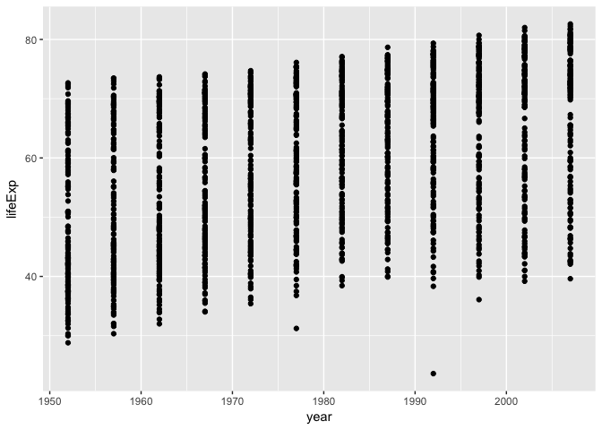
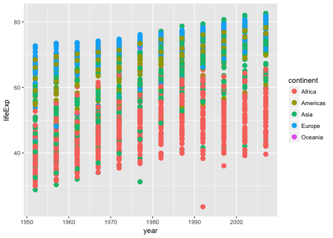
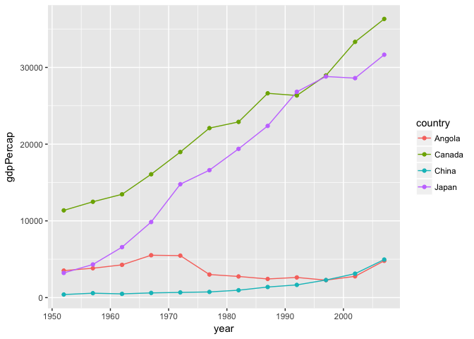
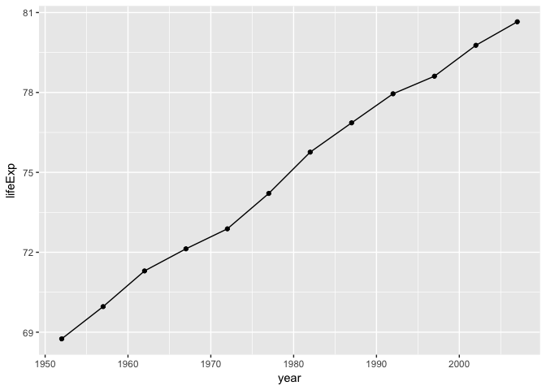
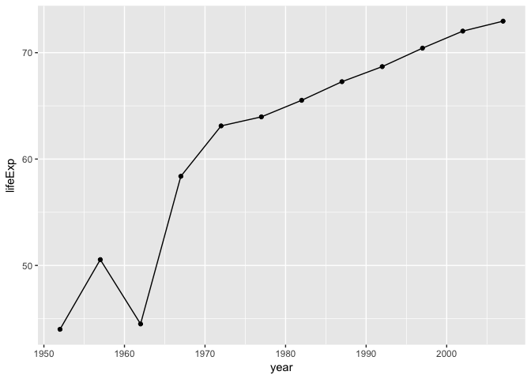
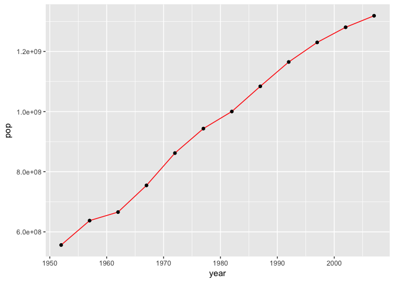

Hw02
================
Jian Gao
2017/09/27

Gapminder Data Exploration
--------------------------

First, install and load the gampminder and tidyverse package to start off with our data.

``` r
install.packages("gapminder",repos = "http://cran.us.r-project.org")
```

    ## 
    ## The downloaded binary packages are in
    ##  /var/folders/49/8x4vsmg52bg_f8qccj5r6pw00000gn/T//RtmpywOXkC/downloaded_packages

``` r
library(gapminder)
install.packages("tidyverse",repos = "http://cran.us.r-project.org")
```

    ## 
    ## The downloaded binary packages are in
    ##  /var/folders/49/8x4vsmg52bg_f8qccj5r6pw00000gn/T//RtmpywOXkC/downloaded_packages

``` r
library(tidyverse)
```

    ## Loading tidyverse: ggplot2
    ## Loading tidyverse: tibble
    ## Loading tidyverse: tidyr
    ## Loading tidyverse: readr
    ## Loading tidyverse: purrr
    ## Loading tidyverse: dplyr

    ## Warning: package 'tibble' was built under R version 3.4.1

    ## Warning: package 'tidyr' was built under R version 3.4.1

    ## Warning: package 'purrr' was built under R version 3.4.1

    ## Warning: package 'dplyr' was built under R version 3.4.1

    ## Conflicts with tidy packages ----------------------------------------------

    ## filter(): dplyr, stats
    ## lag():    dplyr, stats

Smell test the data
-------------------

Before we do any analysis of our data, it is better to understand the properties of the data.We can simply check the data's properties by using R functions.

What is the type of the data?

``` r
typeof(gapminder)
```

    ## [1] "list"

What is the class of the data

``` r
class(gapminder)
```

    ## [1] "tbl_df"     "tbl"        "data.frame"

How many variables are present in the data?

``` r
ncol(gapminder)
```

    ## [1] 6

How many observations do we have for each variable?

``` r
nrow(gapminder)
```

    ## [1] 1704

However, sometimes the data could be arranged different as variables could be in row and observation could be in column. So, we always want to check how the data is arranged as well as the range for the data by using the summary for an overview.

``` r
summary(gapminder)
```

    ##         country        continent        year         lifeExp     
    ##  Afghanistan:  12   Africa  :624   Min.   :1952   Min.   :23.60  
    ##  Albania    :  12   Americas:300   1st Qu.:1966   1st Qu.:48.20  
    ##  Algeria    :  12   Asia    :396   Median :1980   Median :60.71  
    ##  Angola     :  12   Europe  :360   Mean   :1980   Mean   :59.47  
    ##  Argentina  :  12   Oceania : 24   3rd Qu.:1993   3rd Qu.:70.85  
    ##  Australia  :  12                  Max.   :2007   Max.   :82.60  
    ##  (Other)    :1632                                                
    ##       pop              gdpPercap       
    ##  Min.   :6.001e+04   Min.   :   241.2  
    ##  1st Qu.:2.794e+06   1st Qu.:  1202.1  
    ##  Median :7.024e+06   Median :  3531.8  
    ##  Mean   :2.960e+07   Mean   :  7215.3  
    ##  3rd Qu.:1.959e+07   3rd Qu.:  9325.5  
    ##  Max.   :1.319e+09   Max.   :113523.1  
    ## 

Besides the summary of the data, we would sometimes also be interested the extent and size of the data.

For example, the dimsension of the data

``` r
dim(gapminder)
```

    ## [1] 1704    6

This function often combines the result of ncol and nrow.

Also, it is interested to know the strcuture of the data

``` r
str(gapminder)
```

    ## Classes 'tbl_df', 'tbl' and 'data.frame':    1704 obs. of  6 variables:
    ##  $ country  : Factor w/ 142 levels "Afghanistan",..: 1 1 1 1 1 1 1 1 1 1 ...
    ##  $ continent: Factor w/ 5 levels "Africa","Americas",..: 3 3 3 3 3 3 3 3 3 3 ...
    ##  $ year     : int  1952 1957 1962 1967 1972 1977 1982 1987 1992 1997 ...
    ##  $ lifeExp  : num  28.8 30.3 32 34 36.1 ...
    ##  $ pop      : int  8425333 9240934 10267083 11537966 13079460 14880372 12881816 13867957 16317921 22227415 ...
    ##  $ gdpPercap: num  779 821 853 836 740 ...

Sometimes we want to know what variables are present in our dataset

``` r
names(gapminder)
```

    ## [1] "country"   "continent" "year"      "lifeExp"   "pop"       "gdpPercap"

Now, we know the what are the six varibles in the gapminder dataset. We can further explore the type of each varible just like what we did for the whole dataset.

``` r
typeof(gapminder$country)
```

    ## [1] "integer"

``` r
typeof(gapminder$continent)
```

    ## [1] "integer"

``` r
typeof(gapminder$year)
```

    ## [1] "integer"

``` r
typeof(gapminder$lifeExp)
```

    ## [1] "double"

``` r
typeof(gapminder$pop)
```

    ## [1] "integer"

``` r
typeof(gapminder$gdpPercap)
```

    ## [1] "double"

By now, we have an overall glimpse of the structure of our dataset. This first step is crucial in developing further analysis of the data. From here, we would know what type of data is included and we could us this info to determine what type of plot to be used. Also, what variables are present. Are these variables relavent and interesting to our analysis. Also, by using the summary function, we could also know the range of dataset.

Explore individual variables
----------------------------

After we have a genral overview of the whole dataset, we often would be interested in indivdual variables because sometimes we are interested in only certain varibales or we want to have more infomation about certain varibles for further analysis.

For example, if I am particular intesrested in the countries included in the dataset, I could use the summary function just like being used previously for the whole dataset.

``` r
summary(gapminder$country)
```

    ##              Afghanistan                  Albania                  Algeria 
    ##                       12                       12                       12 
    ##                   Angola                Argentina                Australia 
    ##                       12                       12                       12 
    ##                  Austria                  Bahrain               Bangladesh 
    ##                       12                       12                       12 
    ##                  Belgium                    Benin                  Bolivia 
    ##                       12                       12                       12 
    ##   Bosnia and Herzegovina                 Botswana                   Brazil 
    ##                       12                       12                       12 
    ##                 Bulgaria             Burkina Faso                  Burundi 
    ##                       12                       12                       12 
    ##                 Cambodia                 Cameroon                   Canada 
    ##                       12                       12                       12 
    ## Central African Republic                     Chad                    Chile 
    ##                       12                       12                       12 
    ##                    China                 Colombia                  Comoros 
    ##                       12                       12                       12 
    ##         Congo, Dem. Rep.              Congo, Rep.               Costa Rica 
    ##                       12                       12                       12 
    ##            Cote d'Ivoire                  Croatia                     Cuba 
    ##                       12                       12                       12 
    ##           Czech Republic                  Denmark                 Djibouti 
    ##                       12                       12                       12 
    ##       Dominican Republic                  Ecuador                    Egypt 
    ##                       12                       12                       12 
    ##              El Salvador        Equatorial Guinea                  Eritrea 
    ##                       12                       12                       12 
    ##                 Ethiopia                  Finland                   France 
    ##                       12                       12                       12 
    ##                    Gabon                   Gambia                  Germany 
    ##                       12                       12                       12 
    ##                    Ghana                   Greece                Guatemala 
    ##                       12                       12                       12 
    ##                   Guinea            Guinea-Bissau                    Haiti 
    ##                       12                       12                       12 
    ##                 Honduras         Hong Kong, China                  Hungary 
    ##                       12                       12                       12 
    ##                  Iceland                    India                Indonesia 
    ##                       12                       12                       12 
    ##                     Iran                     Iraq                  Ireland 
    ##                       12                       12                       12 
    ##                   Israel                    Italy                  Jamaica 
    ##                       12                       12                       12 
    ##                    Japan                   Jordan                    Kenya 
    ##                       12                       12                       12 
    ##         Korea, Dem. Rep.              Korea, Rep.                   Kuwait 
    ##                       12                       12                       12 
    ##                  Lebanon                  Lesotho                  Liberia 
    ##                       12                       12                       12 
    ##                    Libya               Madagascar                   Malawi 
    ##                       12                       12                       12 
    ##                 Malaysia                     Mali               Mauritania 
    ##                       12                       12                       12 
    ##                Mauritius                   Mexico                 Mongolia 
    ##                       12                       12                       12 
    ##               Montenegro                  Morocco               Mozambique 
    ##                       12                       12                       12 
    ##                  Myanmar                  Namibia                    Nepal 
    ##                       12                       12                       12 
    ##              Netherlands              New Zealand                Nicaragua 
    ##                       12                       12                       12 
    ##                    Niger                  Nigeria                   Norway 
    ##                       12                       12                       12 
    ##                     Oman                 Pakistan                   Panama 
    ##                       12                       12                       12 
    ##                  (Other) 
    ##                      516

From this summary, we can see the countries being included in the dataset as well as how many entries. We can determine if the countries that we are interested are included in the dataset. Since the variable country is character and not numerical, there would be not any numerical statistics in the summary and the table function would be identical to the summary.

``` r
table(gapminder$country)
```

    ## 
    ##              Afghanistan                  Albania                  Algeria 
    ##                       12                       12                       12 
    ##                   Angola                Argentina                Australia 
    ##                       12                       12                       12 
    ##                  Austria                  Bahrain               Bangladesh 
    ##                       12                       12                       12 
    ##                  Belgium                    Benin                  Bolivia 
    ##                       12                       12                       12 
    ##   Bosnia and Herzegovina                 Botswana                   Brazil 
    ##                       12                       12                       12 
    ##                 Bulgaria             Burkina Faso                  Burundi 
    ##                       12                       12                       12 
    ##                 Cambodia                 Cameroon                   Canada 
    ##                       12                       12                       12 
    ## Central African Republic                     Chad                    Chile 
    ##                       12                       12                       12 
    ##                    China                 Colombia                  Comoros 
    ##                       12                       12                       12 
    ##         Congo, Dem. Rep.              Congo, Rep.               Costa Rica 
    ##                       12                       12                       12 
    ##            Cote d'Ivoire                  Croatia                     Cuba 
    ##                       12                       12                       12 
    ##           Czech Republic                  Denmark                 Djibouti 
    ##                       12                       12                       12 
    ##       Dominican Republic                  Ecuador                    Egypt 
    ##                       12                       12                       12 
    ##              El Salvador        Equatorial Guinea                  Eritrea 
    ##                       12                       12                       12 
    ##                 Ethiopia                  Finland                   France 
    ##                       12                       12                       12 
    ##                    Gabon                   Gambia                  Germany 
    ##                       12                       12                       12 
    ##                    Ghana                   Greece                Guatemala 
    ##                       12                       12                       12 
    ##                   Guinea            Guinea-Bissau                    Haiti 
    ##                       12                       12                       12 
    ##                 Honduras         Hong Kong, China                  Hungary 
    ##                       12                       12                       12 
    ##                  Iceland                    India                Indonesia 
    ##                       12                       12                       12 
    ##                     Iran                     Iraq                  Ireland 
    ##                       12                       12                       12 
    ##                   Israel                    Italy                  Jamaica 
    ##                       12                       12                       12 
    ##                    Japan                   Jordan                    Kenya 
    ##                       12                       12                       12 
    ##         Korea, Dem. Rep.              Korea, Rep.                   Kuwait 
    ##                       12                       12                       12 
    ##                  Lebanon                  Lesotho                  Liberia 
    ##                       12                       12                       12 
    ##                    Libya               Madagascar                   Malawi 
    ##                       12                       12                       12 
    ##                 Malaysia                     Mali               Mauritania 
    ##                       12                       12                       12 
    ##                Mauritius                   Mexico                 Mongolia 
    ##                       12                       12                       12 
    ##               Montenegro                  Morocco               Mozambique 
    ##                       12                       12                       12 
    ##                  Myanmar                  Namibia                    Nepal 
    ##                       12                       12                       12 
    ##              Netherlands              New Zealand                Nicaragua 
    ##                       12                       12                       12 
    ##                    Niger                  Nigeria                   Norway 
    ##                       12                       12                       12 
    ##                     Oman                 Pakistan                   Panama 
    ##                       12                       12                       12 
    ##                 Paraguay                     Peru              Philippines 
    ##                       12                       12                       12 
    ##                   Poland                 Portugal              Puerto Rico 
    ##                       12                       12                       12 
    ##                  Reunion                  Romania                   Rwanda 
    ##                       12                       12                       12 
    ##    Sao Tome and Principe             Saudi Arabia                  Senegal 
    ##                       12                       12                       12 
    ##                   Serbia             Sierra Leone                Singapore 
    ##                       12                       12                       12 
    ##          Slovak Republic                 Slovenia                  Somalia 
    ##                       12                       12                       12 
    ##             South Africa                    Spain                Sri Lanka 
    ##                       12                       12                       12 
    ##                    Sudan                Swaziland                   Sweden 
    ##                       12                       12                       12 
    ##              Switzerland                    Syria                   Taiwan 
    ##                       12                       12                       12 
    ##                 Tanzania                 Thailand                     Togo 
    ##                       12                       12                       12 
    ##      Trinidad and Tobago                  Tunisia                   Turkey 
    ##                       12                       12                       12 
    ##                   Uganda           United Kingdom            United States 
    ##                       12                       12                       12 
    ##                  Uruguay                Venezuela                  Vietnam 
    ##                       12                       12                       12 
    ##       West Bank and Gaza              Yemen, Rep.                   Zambia 
    ##                       12                       12                       12 
    ##                 Zimbabwe 
    ##                       12

However, if we are looking into other variables such as years or gdppercaptial, the result of summary would inculde statistic results.

``` r
summary(gapminder$year)
```

    ##    Min. 1st Qu.  Median    Mean 3rd Qu.    Max. 
    ##    1952    1966    1980    1980    1993    2007

The results display that the year 1952 is the minium in the data set and 2007 is the maxium. So we know that the data expands from 1952 to 2007.

``` r
table(gapminder$year)
```

    ## 
    ## 1952 1957 1962 1967 1972 1977 1982 1987 1992 1997 2002 2007 
    ##  142  142  142  142  142  142  142  142  142  142  142  142

The table function tells what years were included and how many entries are associated with each input years. From here we can also see the frequency of data collection.

We would also do one more variable analysis with gdppercapial.

``` r
summary(gapminder$gdpPercap)
```

    ##     Min.  1st Qu.   Median     Mean  3rd Qu.     Max. 
    ##    241.2   1202.1   3531.8   7215.3   9325.5 113523.1

From this chart, we could see the minium gdppercapital and the maxium gdppercapital. Also, we could also see the mean and median of gdppercapital, which was less interest in the previous year summary. We can also plot a histgram to see

``` r
hist(gapminder$gdpPercap)
```

 From the histgram, we can see most countries in most years have gdppercaptial under 20000. Therefore, we can see that depneds on the types of variables, we can generate different information that suits the analysis the most.

Explore various plot types
--------------------------

Most of times we want to have our data plotted in order to generate information about the trend of our data as well as to determine the relationship between two or multi-variables.

For example, if we want to know how would life expectancy correlates with different years. We can make a scatter plot between the two variables.

``` r
x <- ggplot(gapminder,aes(x=year, y=lifeExp))
x + geom_point()
```

 From the plot. we can see that life expectancy tends to increases from 1950s to 2007. In addition, we can introduce another varibale(continent) into this plot by adding colors.We can use geom\_point function.

``` r
x+geom_point(size=3,aes(color=continent))
```

 From this plot we could see that Africa has lower life expectany, whereas Europe has higher life expectancy.

Maybe you are particularly interested in certain countries gdppercapital growth thoughtout the 50 years.

``` r
y <- c("Canada","China","Angola","Japan")
ggplot(subset(gapminder,country %in% y),aes(x=year,y=gdpPercap,color=country))+geom_line()+geom_point()
```

 From this plot, we could see that Japan and Canada have much more drastic increase in gdp per capital compared with Angola and China.

Sometimes, we want to look at the histogram of one variable

``` r
hist(gapminder$lifeExp)
```

 From this plot, we could see that most people have a life expectancy between 70-80.

filter,select and %&gt;%
------------------------

Sometimes we want to focus and zoom in to selected factors. The function filter and select would be handy in helping us archieve this goal. The filter and select function can help us to generate the statistical information we are looking for as well as the plot. The filter function removes For example, if I would like to focus my study on Canada in 2007

``` r
gapminder %>% 
  filter(country %in% "Canada", year == 2007)
```

    ## # A tibble: 1 x 6
    ##   country continent  year lifeExp      pop gdpPercap
    ##    <fctr>    <fctr> <int>   <dbl>    <int>     <dbl>
    ## 1  Canada  Americas  2007  80.653 33390141  36319.24

Ok. Now we want to take one step further to look at how Canada has changed after the year 1967.

``` r
gapminder %>% 
  filter(country %in% "Canada", year>1962)
```

    ## # A tibble: 9 x 6
    ##   country continent  year lifeExp      pop gdpPercap
    ##    <fctr>    <fctr> <int>   <dbl>    <int>     <dbl>
    ## 1  Canada  Americas  1967  72.130 20819767  16076.59
    ## 2  Canada  Americas  1972  72.880 22284500  18970.57
    ## 3  Canada  Americas  1977  74.210 23796400  22090.88
    ## 4  Canada  Americas  1982  75.760 25201900  22898.79
    ## 5  Canada  Americas  1987  76.860 26549700  26626.52
    ## 6  Canada  Americas  1992  77.950 28523502  26342.88
    ## 7  Canada  Americas  1997  78.610 30305843  28954.93
    ## 8  Canada  Americas  2002  79.770 31902268  33328.97
    ## 9  Canada  Americas  2007  80.653 33390141  36319.24

We have seen that the life expectancy, population, and gdp per capital have all increased from 1967 to 2007.

It would be nice to depict the trend on a plot. For example, if we want to make a plot of year vs life expanctancy of Canadians. We can use the filter function.

``` r
ggplot(gapminder %>% 
         filter(country == "Canada"), aes(x = year, y = lifeExp)) + geom_line() + geom_point()
```

 We can see that the life expectancy of Canadaian raised from around 69 to 81.

One more useful function of filter is that it can also remove all the unwanted data. For example, if we want to see all countires except American countries. We can also use filter.

``` r
filter(gapminder,continent !="America")
```

    ## # A tibble: 1,704 x 6
    ##        country continent  year lifeExp      pop gdpPercap
    ##         <fctr>    <fctr> <int>   <dbl>    <int>     <dbl>
    ##  1 Afghanistan      Asia  1952  28.801  8425333  779.4453
    ##  2 Afghanistan      Asia  1957  30.332  9240934  820.8530
    ##  3 Afghanistan      Asia  1962  31.997 10267083  853.1007
    ##  4 Afghanistan      Asia  1967  34.020 11537966  836.1971
    ##  5 Afghanistan      Asia  1972  36.088 13079460  739.9811
    ##  6 Afghanistan      Asia  1977  38.438 14880372  786.1134
    ##  7 Afghanistan      Asia  1982  39.854 12881816  978.0114
    ##  8 Afghanistan      Asia  1987  40.822 13867957  852.3959
    ##  9 Afghanistan      Asia  1992  41.674 16317921  649.3414
    ## 10 Afghanistan      Asia  1997  41.763 22227415  635.3414
    ## # ... with 1,694 more rows

Select is another function being used for sorting data. Unlike filter, select will drop other result associate with the selected subject. This function is more specific.

Foe example

``` r
select(gapminder,country,year)
```

    ## # A tibble: 1,704 x 2
    ##        country  year
    ##         <fctr> <int>
    ##  1 Afghanistan  1952
    ##  2 Afghanistan  1957
    ##  3 Afghanistan  1962
    ##  4 Afghanistan  1967
    ##  5 Afghanistan  1972
    ##  6 Afghanistan  1977
    ##  7 Afghanistan  1982
    ##  8 Afghanistan  1987
    ##  9 Afghanistan  1992
    ## 10 Afghanistan  1997
    ## # ... with 1,694 more rows

Only the variables inculded by select function is included in the result. This function could trim down the unneccessary data.

Piping
------

Now, we can try combine filter and select functions and have only the data we are interested. For exmaple, if we want to a look at how Chinese's life expectancy have changed from 50s to 2007. We can first filter to remove all other countries

``` r
filter(gapminder, country == c("China")) %>%
         select(year,lifeExp)
```

    ## # A tibble: 12 x 2
    ##     year  lifeExp
    ##    <int>    <dbl>
    ##  1  1952 44.00000
    ##  2  1957 50.54896
    ##  3  1962 44.50136
    ##  4  1967 58.38112
    ##  5  1972 63.11888
    ##  6  1977 63.96736
    ##  7  1982 65.52500
    ##  8  1987 67.27400
    ##  9  1992 68.69000
    ## 10  1997 70.42600
    ## 11  2002 72.02800
    ## 12  2007 72.96100

The result only shows the selected year and life expectancy. Now, we want to plot the data.

``` r
filter(gapminder, country == c("China")) %>%
  select(year, lifeExp) %>%
  ggplot(aes(year, lifeExp)) + geom_line() + geom_point()
```



The result shows that around 1960, there is a decrease in life expectancy in China. We would like to verify if this affects the population of China.

``` r
filter(gapminder, country == c("China")) %>%
  select(year, pop) %>%
  ggplot(aes(year, pop)) + geom_line(color="red") + geom_point()
```

 In this plot, we have found that around that thr 1960, the rate of population increase has decreased as the slope of the line is less steep. Something happend in China during that period, could be war, disaster or political reasons.

Report me process
-----------------

In this homework, I have learnt to determine the types of data and how to quickly acquire the basic and essentail information about hte data. In additon, I learnt how to plot various types of plots as well as how to pick the data related to the study.Thoses I found are particular helpful. I had a bot hard time in understanding the type of data. For example, matrice, data frames and list. Also, I am a bit confused about the function of the syntax %&gt;%.
